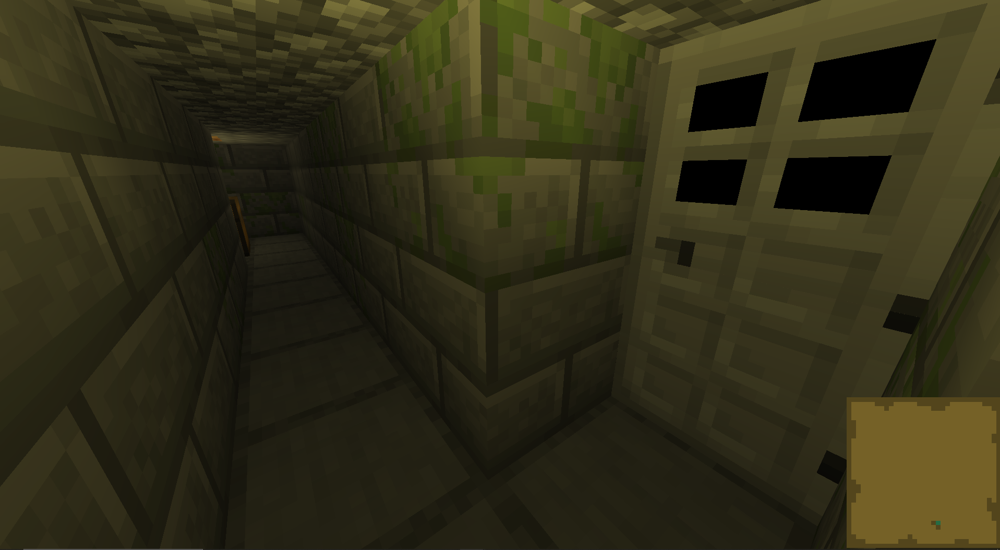
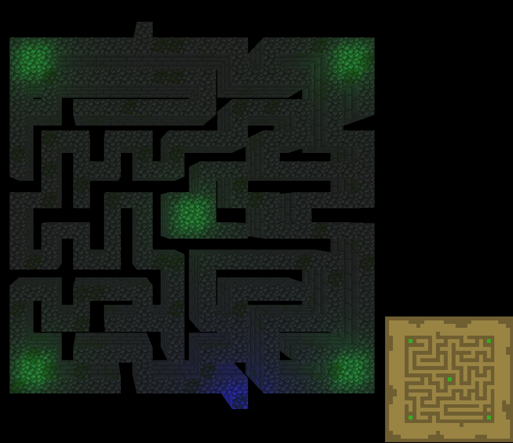

# Random Maze 3D

## General Infromation

This project was created for the ISART Digital school by Rémi Serra.  
The end goal was to create a maze using OpenGL 2 and C++, which the player could explore. It had to be textured, lit and could optionally have collisions.   
 
The player is positionned at the start of a randomly generated and textured maze.   
They must explore it to find the 5 rooms where chests need to be opened.   
Once all chests have been opened, the exit door will open and the player will be able to exit the maze.  
When this happens, collisions are disabled, all of the paths are revealed on the minimap, and a bright light is turned on.  

 

## Preview

## Build and launch

Use the make command to build the project and start the "maze" executable to launch it (exclusive to Linux).

 

## Camera controls

Use `WASD` to move the camera in the world.  
`Right click` and move the mouse to rotate the camera.  
`Space` and `shift` can be used to move up and down (the player will clip through the ground and ceiling).  
Use the `R` and `F` keys to toggle the minimap.  
Use the `1` and `2` keys to toggle wireframe view.  
Use the `3` and `4` keys to switch between perspective and orthographic views.  
Use the `5` and `6` keys to toggle a bright ambient light.  
Use the `7` and `8` keys to toggle the player's point light.  
Use the `9` and `0` keys to toggle collisions with the maze.  
Use the numpad numbers and decimal point to test the rendering of basic shapes.  
(for some reason GL_COLOR_MATERIAL makes the lights brighter, and the only fix is to restart the program)

 

## Codebase overview

### draw.hpp defines functions to draw shapes:
- Textured triangles
- Textured quads
- Textured quads divided in two triangles
- Textured cubes (with divided quad faces)
- Subdivided cubes (with each subdivision being a divided quad)
- Spheres
- Spheres made of points
- Cones
- Gizmos

 

### camera.hpp defines:
- a camera class
- a function to update the camera position according to player input
- a funtions to apply the camera's transformations to the modelview matrix

 

### bmpLoader.hpp defines:
- a function to load an OpenGL texture from a bmp file
- a function to load the data from a bmp file as an array of pixels
- a function to load an OpenGl texture from an array of pixels

 

### lights.hpp defines:
- a function to setup all of the lights of the scene
- a function to update all of the positions of the lights

 

### mazeGen.hpp defines:
- a maze generator class
- a function to generate a maze of given size
- a function to render the generated maze
- a function to check if the player is inside the maze
- a function to move the player back inside the maze

 

### minimap.hpp defines:
- a minimap class
- a function to update the minimap according to the player's position
- a function to update the minimap when a chest is opened
- a function to show all of the paths of the maze on the minimap
- a function to render the minimap on the player's hud

 

### interactable.hpp defines:
- an interactable object class, which creates a position where the player can press a key to interact with the object
- a function that returns true when the player interacts with the object
